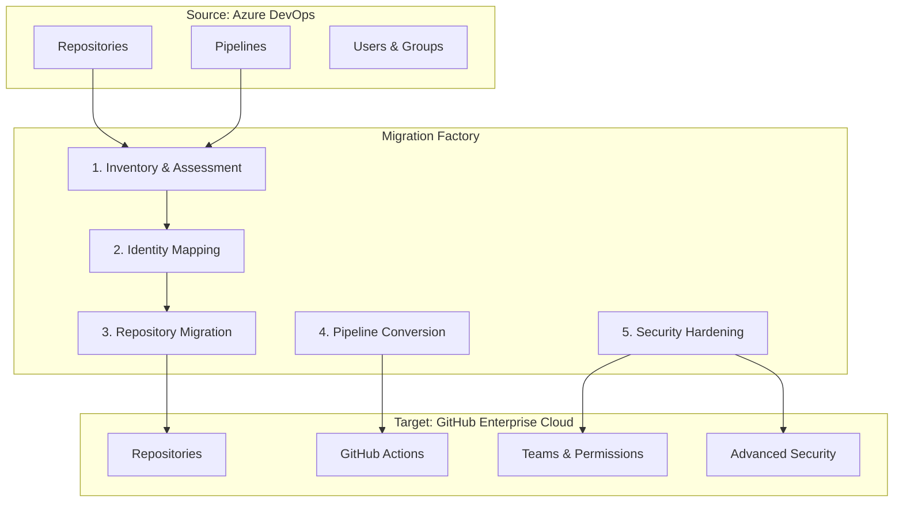

# Azure DevOps to GitHub Enterprise Cloud Migration Factory

A comprehensive toolkit and process for migrating repositories, pipelines, and security configurations from Azure DevOps to GitHub Enterprise Cloud.

## 🎯 Overview

This migration factory provides a structured, automated approach to migrate your Azure DevOps organization to GitHub Enterprise Cloud while maintaining security, history, and team collaboration patterns.

### Key Features
- **Automated Inventory**: Complete audit of ADO repositories, pipelines, and permissions
- **Identity Mapping**: Seamless user attribution with GitHub's mannequin system
- **Repository Migration**: Full history preservation including PRs, issues, and wiki
- **Pipeline Conversion**: Azure DevOps YAML to GitHub Actions transformation
- **Security Hardening**: Automated branch protection and security feature enablement

## 📋 Prerequisites

### **IMPORTANT**: Security & Permissions
Before starting, review the comprehensive [Permissions Matrix](docs/permissions-matrix.md) which details:
- Exact permission requirements for each migration phase
- Token creation and security best practices
- Survey vs. migration permission differences
- External security tool authentication requirements
- Compliance and audit considerations

### Required Tools
- **PowerShell Core 7.x** (cross-platform)
- **GitHub CLI** with extensions:
  ```bash
  gh extension install github/gh-gei
  gh extension install github/gh-actions-importer
  ```
- **Azure CLI** (for ADO access)
- **Git** (latest version)

### Required Access

#### Azure DevOps Permissions (Personal Access Token)
Create a PAT with the following minimum scopes:
- **Code**: Read & Write (for repository access)
- **Build**: Read (for pipeline analysis)
- **Release**: Read (for release pipeline analysis)
- **Project and Team**: Read (for organization structure)
- **User Profile**: Read (for user information)

**Survey Permissions**: The inventory script (`01-inventory.ps1`) only requires **Read** permissions for all scopes.

**Migration Permissions**: The migration script (`03-migrate-repos.ps1`) requires **Read** permissions on ADO and appropriate **Write** permissions on GitHub.

#### GitHub Enterprise Cloud Permissions
- **Organization Owner** role (for repository creation and security configuration)
- **Admin** role on target repositories (for branch protection and security settings)
- **GitHub App** or **Personal Access Token** with these scopes:
  - `repo` (full repository access)
  - `admin:org` (organization management)
  - `workflow` (GitHub Actions management)
  - `write:packages` (for package registry)
  - `admin:public_key` (for deploy keys)
  - `admin:gpg_key` (for commit signing)

#### Entra ID (Azure AD) Permissions
- **Global Administrator** or **User Administrator** (for SCIM provisioning)
- **Application Administrator** (for SSO configuration)

### Environment Variables
Create a `.env` file in the root directory:
```bash
# Azure DevOps
ADO_ORG="your-ado-organization"
ADO_PAT="your-ado-pat-token"

# GitHub Enterprise Cloud
GH_ORG="your-github-org"
GH_TOKEN="your-github-pat-token"

# Identity Provider
ENTRA_TENANT_ID="your-entra-tenant-id"
```

## 🏗️ Migration Architecture



## ⏱️ Migration Time Estimates

The following table provides estimated migration times based on repository count. These estimates assume:
- Average repository size of 100-500 MB
- Standard network connectivity (100+ Mbps)
- Batch size of 10 repositories
- Including identity mapping and basic security configuration

| Repositories | Phase 1: Inventory | Phase 2: Identity | Phase 3: Migration | Phase 4: Pipelines | Phase 5-6: Security | **Total Estimate** |
|-------------:|-------------------:|------------------:|-------------------:|-------------------:|--------------------:|-------------------:|
| 100          | 15-30 min          | 10-20 min         | 2-4 hours          | 1-2 hours          | 30-60 min           | **4-8 hours**      |
| 200          | 30-45 min          | 15-30 min         | 4-8 hours          | 2-4 hours          | 1-2 hours           | **8-15 hours**     |
| 300          | 45-60 min          | 20-40 min         | 6-12 hours         | 3-6 hours          | 1.5-3 hours         | **12-22 hours**    |
| 500          | 1-1.5 hours        | 30-60 min         | 10-20 hours        | 5-10 hours         | 2-4 hours           | **19-36 hours**    |
| 1000         | 2-3 hours          | 1-2 hours         | 20-40 hours        | 10-20 hours        | 4-8 hours           | **37-73 hours**    |
| 1500         | 3-4.5 hours        | 1.5-3 hours       | 30-60 hours        | 15-30 hours        | 6-12 hours          | **56-110 hours**   |
| 2000         | 4-6 hours          | 2-4 hours         | 40-80 hours        | 20-40 hours        | 8-16 hours          | **74-146 hours**   |
| 3000         | 6-9 hours          | 3-6 hours         | 60-120 hours       | 30-60 hours        | 12-24 hours         | **111-219 hours**  |

### Factors Affecting Migration Time

**Increases migration time:**
- Large repositories (>1 GB)
- Complex pipeline configurations
- High number of branches per repository
- Large binary files or LFS content
- Rate limiting due to API quotas
- Network latency or bandwidth constraints

**Decreases migration time:**
- Smaller repositories
- Excluding inactive repositories (use `08-analyze-activity.ps1`)
- Parallel migration execution
- Higher batch sizes (with adequate rate limits)
- Pre-cleaned repositories (removed unnecessary branches)

### Optimization Tips

1. **Analyze activity first**: Run `08-analyze-activity.ps1` to identify inactive repositories
2. **Exclude inactive repos**: Skip repositories with no activity in 12+ months
3. **Run during off-peak hours**: Reduced API contention improves throughput
4. **Use appropriate batch sizes**: Start with 5-10, increase if no rate limiting
5. **Migrate in waves**: Critical repos first, then less important ones

## 🚀 Migration Process

### Phase 0: Prerequisites & Validation
**Always start here** to ensure your environment is properly configured:
```powershell
./scripts/00-prereq-check.ps1 -AdoOrg "myorg" -AdoPat "ado-pat" -GhOrg "myghorg" -GhToken "gh-pat"
```
This validates:
- ✅ Tool installations (Git, PowerShell, GitHub CLI, extensions)
- ✅ Token permissions and scopes
- ✅ Connectivity to Azure DevOps and GitHub
- ✅ External security tool availability (Checkov, pre-commit, etc.)
- ✅ Security configurations and best practices

### Phase 1: Assessment & Inventory
Run the inventory script to understand your current state:
```powershell
./scripts/01-inventory.ps1
```
This generates:
- `inventory-repos.csv` - All repositories with sizes and last activity
- `inventory-pipelines.csv` - All pipelines with types and complexity
- `inventory-users.csv` - All users and their permissions

### Phase 1.5: Activity Analysis (Recommended)
**Before migrating**, analyze repository activity to identify inactive repositories that may not need migration:
```powershell
# Analyze all repos for activity in the last 12 months
./scripts/08-analyze-activity.ps1 -AdoOrg "myorg" -AdoPat "ado-pat"

# Customize inactivity period (e.g., 6 months)
./scripts/08-analyze-activity.ps1 -AdoOrg "myorg" -AdoPat "ado-pat" -InactivityMonths 6

# Generate migration candidates list (exclude inactive repos)
./scripts/08-analyze-activity.ps1 -AdoOrg "myorg" -AdoPat "ado-pat" -ExcludeInactive

# Filter by project
./scripts/08-analyze-activity.ps1 -AdoOrg "myorg" -AdoPat "ado-pat" -ProjectFilter "MyProject"
```

This generates:
- `activity-analysis-full-TIMESTAMP.csv` - Complete activity report for all repos
- `activity-analysis-active-TIMESTAMP.csv` - Repositories with recent activity
- `activity-analysis-inactive-TIMESTAMP.csv` - Repositories with no recent activity
- `activity-analysis-summary-TIMESTAMP.json` - Summary statistics and recommendations
- `migration-candidates-TIMESTAMP.csv` - Repos recommended for migration (with `-ExcludeInactive`)

**Activity Criteria:**
| Metric | Default Threshold | Configurable Parameter |
|--------|-------------------|------------------------|
| Commits in period | >= 1 commit | `-MinCommits` |
| Pipeline runs in period | >= 0 runs | `-MinPipelineRuns` |
| Inactivity window | 12 months | `-InactivityMonths` |

**Benefits of Activity Analysis:**
- **Reduce migration scope**: Skip inactive repos to save time and resources
- **Identify archival candidates**: Repos with no activity may be candidates for archival
- **Prioritize migration**: Focus on actively used repositories first
- **Accurate time estimates**: Better planning with reduced repository count

### Phase 2: Identity Foundation
Configure SSO and create the identity mapping:
```powershell
./scripts/02-generate-mappings.ps1
```
This creates the mannequin mapping file for proper attribution.

### Phase 3: Repository Migration
Execute the repository migration:
```powershell
./scripts/03-migrate-repos.ps1 -BatchSize 10
```
Features:
- Batch processing to avoid rate limits
- Progress tracking with detailed logs
- Automatic retry on failure
- Preserves all history, PRs, and issues

### Phase 4: Pipeline Analysis & Conversion
Analyze and convert your pipelines:
```powershell
./scripts/04-audit-pipelines.ps1
./scripts/05-convert-pipelines.ps1 -WhatIf
```

### Phase 5: Security Hardening
Apply security best practices:
```powershell
./scripts/06-configure-security.ps1
```
This enables:
- Branch protection rules
- Required status checks
- Secret scanning
- Dependabot alerts
- CodeQL analysis

### Phase 6: DevSecOps Integration
Configure external security tools and pre-commit hooks:
```powershell
# Configure all available tools
./scripts/07-configure-integrations.ps1 -GhOrg "myorg" -GhToken "gh-pat" -Tools "All"

# Or configure specific tools
./scripts/07-configure-integrations.ps1 -GhOrg "myorg" -GhToken "gh-pat" -Tools "Checkov,SonarQube,PreCommit" -SonarOrg "my-sonar-org"
```
This creates:
- **Checkov**: Infrastructure as Code security scanning
- **SonarQube Cloud**: Code quality and security analysis
- **Black Duck**: Software composition analysis (if configured)
- **Aqua Security**: Container and filesystem scanning (if configured)
- **Pre-commit hooks**: Local code quality checks

**Prerequisites for external tools:**
- Set up organization secrets in GitHub (SONAR_TOKEN, SONAR_ORGANIZATION, etc.)
- Configure external tool accounts (SonarQube, Black Duck, AquaSec)
- Review workflow templates in `templates/workflows/` for customization

### Migration Dashboard
Use the interactive dashboard to monitor migration progress and set prioritization:
```powershell
# Launch interactive dashboard
./scripts/09-migration-dashboard.ps1 -AdoOrg "myorg" -AdoPat "ado-pat" -GhOrg "ghorg" -GhToken "gh-pat"

# Generate priority list with specific mode
./scripts/09-migration-dashboard.ps1 -AdoOrg "myorg" -AdoPat "ado-pat" -PriorityMode "Activity" -GeneratePriorityList

# Include inactive repos in the list
./scripts/09-migration-dashboard.ps1 -AdoOrg "myorg" -AdoPat "ado-pat" -IncludeInactive -GeneratePriorityList
```

**Dashboard Features:**
- Real-time migration status (Pending, In Progress, Migrated, Failed)
- Repository statistics (total, active, inactive)
- Progress visualization with percentage completion
- Top priority repositories view
- Interactive priority management

**Prioritization Modes:**
| Mode | Description | Best For |
|------|-------------|----------|
| Activity | Prioritize most active repositories | Migrating critical repos first |
| Size | Prioritize smallest repositories | Quick wins, faster initial progress |
| Complexity | Prioritize simpler repositories | Reducing risk, easier validation |
| Custom | Use custom priority CSV file | Specific business requirements |
| Interactive | Choose mode during runtime | Flexible planning sessions |

**Dashboard Reports:**
- `migration-priority-list-TIMESTAMP.csv` - Ordered migration list
- `migration-summary-TIMESTAMP.json` - Overall statistics

**Interactive Commands:**
- `[R]` Refresh - Update status from GitHub
- `[P]` Priority - Change prioritization mode
- `[E]` Export - Save current priority list
- `[S]` Start - Show migration command
- `[Q]` Quit - Exit dashboard

## 📁 Project Structure

```
migration-factory/
├── scripts/                      # Core automation scripts
│   ├── 00-prereq-check.ps1       # Prerequisites validation
│   ├── 01-inventory.ps1          # ADO inventory and assessment
│   ├── 02-generate-mappings.ps1  # Identity mapping generation
│   ├── 03-migrate-repos.ps1      # Repository migration executor
│   ├── 04-audit-pipelines.ps1    # Pipeline analysis
│   ├── 05-convert-pipelines.ps1  # Pipeline conversion
│   ├── 06-configure-security.ps1 # Security hardening
│   ├── 07-configure-integrations.ps1 # DevSecOps tool integration
│   ├── 08-analyze-activity.ps1   # Repository activity analysis
│   ├── 09-migration-dashboard.ps1 # Migration dashboard & prioritization
│   ├── 10-monitor-migration.ps1  # Automated monitoring system
│   ├── 11-alert-system.ps1       # Alert notifications
│   ├── 12-log-manager.ps1        # Log management & aggregation
│   ├── 13-migrate-workitems-jira.ps1  # ADO to Jira work item migration
│   └── 14-jira-github-integration.ps1 # Jira-GitHub Actions integration
├── docs/                         # Detailed documentation
│   ├── architecture.md           # Technical architecture details
│   ├── permissions-matrix.md     # Permission requirements
│   ├── troubleshooting.md        # Common issues and solutions
│   └── rollback-plan.md          # Rollback procedures
├── templates/                    # Configuration templates
│   ├── branch-protection.json    # Branch protection rules
│   ├── pre-commit-config.yaml    # Pre-commit hooks configuration
│   ├── alert-config.json         # Alert system configuration
│   ├── jira-config.json          # Jira migration configuration
│   └── workflows/                # GitHub Actions workflow templates
│       ├── checkov.yml           # Checkov IaC scanning
│       ├── sonarqube-cloud.yml   # SonarQube analysis
│       ├── blackduck.yml         # Black Duck SCA scanning
│       ├── aquasec.yml           # Aqua Security scanning
│       └── jira-integration.yml  # Jira-GitHub integration workflow
├── logs/                         # Migration execution logs
├── reports/                      # Generated assessment reports
│   └── metrics/                  # Performance metrics
├── .env.example                  # Environment variables template
└── README.md                     # This file
```

## 🔧 Configuration

### Branch Protection Template
The security script uses a configurable template for branch protection rules. Edit `templates/branch-protection.json` to customize:
```json
{
  "required_status_checks": {
    "strict": true,
    "contexts": ["continuous-integration"]
  },
  "enforce_admins": false,
  "required_pull_request_reviews": {
    "required_approving_review_count": 2,
    "dismiss_stale_reviews": true,
    "require_code_owner_reviews": true
  },
  "restrictions": null,
  "allow_force_pushes": false,
  "allow_deletions": false
}
```

## 📊 Monitoring, Logging & Alerts

### Automated Monitoring System
Continuous monitoring of migration progress with health checks and alerting:
```powershell
# Start continuous monitoring
./scripts/10-monitor-migration.ps1 -AdoOrg "myorg" -AdoPat "pat" -GhOrg "ghorg" -GhToken "token" -ContinuousMode

# Single status check
./scripts/10-monitor-migration.ps1 -AdoOrg "myorg" -AdoPat "pat" -GhOrg "ghorg" -GhToken "token"

# Custom monitoring interval (10 minutes)
./scripts/10-monitor-migration.ps1 -AdoOrg "myorg" -AdoPat "pat" -GhOrg "ghorg" -GhToken "token" -MonitoringInterval 600 -ContinuousMode
```

**Monitoring Features:**
- Real-time migration progress tracking
- Health checks for Azure DevOps API, GitHub API, and network connectivity
- Migration rate calculation and ETA estimation
- Automatic alerting on failures, stalls, or health issues
- Structured logging (plain text and JSON)
- Performance metrics collection

### Alert System
Multi-channel alerting for migration events:
```powershell
# Send a manual alert
./scripts/11-alert-system.ps1 -AlertType "MigrationFailed" -Severity "High" -Message "Repository xyz failed to migrate"

# Test alert configuration
./scripts/11-alert-system.ps1 -TestMode

# Send alert to specific channel
./scripts/11-alert-system.ps1 -AlertType "Custom" -Severity "Info" -Message "Migration paused" -Channel "Slack"
```

**Alert Channels:**
| Channel | Configuration | Use Case |
|---------|--------------|----------|
| Console | Always enabled | Local monitoring |
| Slack | Webhook URL | Team notifications |
| Microsoft Teams | Webhook URL | Enterprise notifications |
| Email | SMTP settings | Critical alerts, reports |

**Alert Types:**
- `MigrationStarted` - Migration process initiated
- `MigrationComplete` - All repositories migrated successfully
- `MigrationFailed` - Repository migration failure
- `MigrationProgress` - Progress milestones (25%, 50%, 75%, 90%)
- `MigrationStalled` - No progress for configured duration
- `HealthCheckFailed` - API or network health issues
- `RateLimitWarning` - Approaching API rate limits

**Alert Configuration** (`templates/alert-config.json`):
```json
{
  "enabled": true,
  "channels": {
    "slack": {
      "enabled": true,
      "webhookUrl": "https://hooks.slack.com/services/YOUR/WEBHOOK"
    },
    "teams": {
      "enabled": true,
      "webhookUrl": "https://outlook.office.com/webhook/YOUR/WEBHOOK"
    },
    "email": {
      "enabled": true,
      "smtpServer": "smtp.example.com",
      "from": "alerts@example.com",
      "to": ["admin@example.com"]
    }
  },
  "thresholds": {
    "failureRatePercent": 10,
    "stalledMinutes": 60
  },
  "quietHours": {
    "enabled": true,
    "start": "22:00",
    "end": "07:00",
    "allowCritical": true
  }
}
```

### Log Management
Centralized log management with rotation, archival, and analysis:
```powershell
# View log statistics
./scripts/12-log-manager.ps1 -Action Stats

# Rotate large log files
./scripts/12-log-manager.ps1 -Action Rotate -MaxFileSizeMB 100

# Clean up old logs (older than 30 days)
./scripts/12-log-manager.ps1 -Action Cleanup -RetentionDays 30

# Archive logs older than 7 days
./scripts/12-log-manager.ps1 -Action Archive -Compress

# Search logs for errors
./scripts/12-log-manager.ps1 -Action Search -SearchLevel "ERROR" -OutputFormat HTML

# Generate log report
./scripts/12-log-manager.ps1 -Action Report -OutputFormat HTML

# Aggregate all logs into single file
./scripts/12-log-manager.ps1 -Action Aggregate
```

**Log Management Features:**
| Action | Description |
|--------|-------------|
| Stats | Display log statistics and health |
| Rotate | Rotate logs exceeding size threshold |
| Cleanup | Remove logs older than retention period |
| Archive | Compress and archive old logs |
| Search | Search logs by pattern, level, or date |
| Report | Generate HTML/CSV/JSON reports |
| Aggregate | Combine all logs into single file |

**Log Files Generated:**
- `logs/monitor-YYYY-MM-DD.log` - Monitoring logs (plain text)
- `logs/monitor-YYYY-MM-DD.json` - Monitoring logs (structured JSON)
- `logs/alerts-YYYY-MM-DD.log` - Alert history
- `reports/metrics/metrics-YYYY-MM-DD.json` - Performance metrics

## 🎫 Jira Migration & Integration

### Overview
Migrate Azure DevOps work items to Jira and set up bidirectional integration between Jira and GitHub Actions. This enables teams transitioning from Azure DevOps to use Jira for issue tracking while maintaining automated workflows with GitHub.

### Work Item Migration to Jira
Migrate Azure DevOps work items (Bugs, Tasks, User Stories, etc.) to Jira Cloud or Data Center:

```powershell
# Basic migration
./scripts/13-migrate-workitems-jira.ps1 `
    -AdoOrg "myorg" -AdoPat $env:ADO_PAT -AdoProject "MyProject" `
    -JiraUrl "https://company.atlassian.net" -JiraEmail "user@company.com" `
    -JiraApiToken $env:JIRA_TOKEN -JiraProject "PROJ"

# Dry-run to preview changes
./scripts/13-migrate-workitems-jira.ps1 `
    -AdoOrg "myorg" -AdoPat $env:ADO_PAT -AdoProject "MyProject" `
    -JiraUrl "https://company.atlassian.net" -JiraEmail "user@company.com" `
    -JiraApiToken $env:JIRA_TOKEN -JiraProject "PROJ" -WhatIf

# With custom field mapping
./scripts/13-migrate-workitems-jira.ps1 `
    -AdoOrg "myorg" -AdoPat $env:ADO_PAT -AdoProject "MyProject" `
    -JiraUrl "https://company.atlassian.net" -JiraEmail "user@company.com" `
    -JiraApiToken $env:JIRA_TOKEN -JiraProject "PROJ" `
    -MappingFile "./templates/jira-config.json"

# Migrate specific work item types only
./scripts/13-migrate-workitems-jira.ps1 `
    -AdoOrg "myorg" -AdoPat $env:ADO_PAT -AdoProject "MyProject" `
    -JiraUrl "https://company.atlassian.net" -JiraEmail "user@company.com" `
    -JiraApiToken $env:JIRA_TOKEN -JiraProject "PROJ" `
    -WorkItemTypes @("Bug", "User Story")
```

**Migration Features:**
- Full work item field mapping (title, description, state, priority, etc.)
- Attachment migration with binary content
- Comment history preservation
- Work item link preservation (parent/child, related, etc.)
- User mapping between ADO and Jira
- Batch processing with rate limiting
- Resume capability for interrupted migrations
- Detailed migration reports

**Field Mappings:**
| Azure DevOps Field | Jira Field |
|-------------------|------------|
| System.Title | Summary |
| System.Description | Description |
| System.State | Status |
| System.AssignedTo | Assignee |
| Microsoft.VSTS.Common.Priority | Priority |
| System.Tags | Labels |
| Microsoft.VSTS.Scheduling.StoryPoints | Story Points (custom) |

**Work Item Type Mappings:**
| Azure DevOps Type | Jira Type |
|------------------|-----------|
| Bug | Bug |
| Task | Task |
| User Story | Story |
| Feature | Epic |
| Epic | Epic |

### Jira-GitHub Integration
Set up bidirectional integration between Jira and GitHub Actions:

```powershell
# Configure integration and deploy workflows
./scripts/14-jira-github-integration.ps1 `
    -GitHubOrg "myghorg" -GitHubPat $env:GH_TOKEN `
    -JiraUrl "https://company.atlassian.net" -JiraEmail "user@company.com" `
    -JiraApiToken $env:JIRA_TOKEN -JiraProject "PROJ" `
    -DeployWorkflows -ConfigureSecrets

# Configure specific repositories only
./scripts/14-jira-github-integration.ps1 `
    -GitHubOrg "myghorg" -GitHubPat $env:GH_TOKEN `
    -JiraUrl "https://company.atlassian.net" -JiraEmail "user@company.com" `
    -JiraApiToken $env:JIRA_TOKEN -JiraProject "PROJ" `
    -Repositories @("repo1", "repo2") `
    -DeployWorkflows -ConfigureSecrets

# Preview changes without deploying
./scripts/14-jira-github-integration.ps1 `
    -GitHubOrg "myghorg" -GitHubPat $env:GH_TOKEN `
    -JiraUrl "https://company.atlassian.net" -JiraEmail "user@company.com" `
    -JiraApiToken $env:JIRA_TOKEN -JiraProject "PROJ" `
    -DeployWorkflows -WhatIf
```

**Integration Features:**
- Automatic Jira issue transitions based on PR lifecycle
- Commit linking to Jira issues
- PR/branch validation for Jira issue keys
- Release notes generation from Jira
- Bidirectional status synchronization
- GitHub issue to Jira sync (with label)

**Deployed Workflows:**
| Workflow | Description |
|----------|-------------|
| jira-issue-transition | Transitions Jira issues when PRs are opened/merged |
| jira-create-issue | Creates Jira issues from GitHub issues |
| jira-sync-status | Syncs Jira status to GitHub labels |
| jira-release-notes | Generates release notes from Jira |

**Branch Naming Convention:**
For automatic issue linking, use branch names that include the Jira issue key:
- `feature/PROJ-123-add-login-form`
- `bugfix/PROJ-456-fix-null-pointer`
- `PROJ-789-update-documentation`

**PR Title Convention:**
Include the Jira issue key in PR titles:
- `PROJ-123: Add user login form`
- `[PROJ-456] Fix null pointer exception`

**Automatic Transitions:**
| GitHub Event | Jira Transition |
|--------------|-----------------|
| PR Opened | In Progress / In Review |
| PR Merged | Done / Resolved |
| Push to main | (Comment added) |

### Jira Configuration
Configure field mappings and integration settings in `templates/jira-config.json`:

```json
{
  "jira": {
    "connection": {
      "url": "https://company.atlassian.net",
      "cloudOrServer": "cloud"
    },
    "defaultProject": "PROJ"
  },
  "fieldMappings": {
    "workItemTypes": {
      "Bug": "Bug",
      "Task": "Task",
      "User Story": "Story"
    },
    "states": {
      "New": "To Do",
      "Active": "In Progress",
      "Resolved": "Done"
    }
  },
  "gitHubIntegration": {
    "transitionMappings": {
      "pull_request.opened": { "transition": "In Progress" },
      "pull_request.merged": { "transition": "Done" }
    }
  }
}
```

### Required Jira Permissions
Create a Jira API token with these permissions:
- **Browse Projects**: View project and issue details
- **Create Issues**: Create new issues
- **Edit Issues**: Update issue fields
- **Add Comments**: Add comments to issues
- **Create Attachments**: Upload attachments
- **Transition Issues**: Change issue status

### GitHub Secrets for Jira Integration
The integration script configures these organization secrets:
| Secret | Description |
|--------|-------------|
| JIRA_BASE_URL | Your Jira instance URL |
| JIRA_USER_EMAIL | Email for Jira API authentication |
| JIRA_API_TOKEN | Jira API token |
| JIRA_PROJECT_KEY | Default Jira project key |

### Validation Checklist
After migration, verify:
- [ ] All repositories migrated with full history
- [ ] Branch protection rules applied
- [ ] Team permissions correctly mapped
- [ ] Pipelines converted and functional
- [ ] Security scanning enabled
- [ ] Wiki content migrated
- [ ] Webhooks and integrations updated

## 🔄 Rollback Plan

If issues arise, the rollback process:
1. **Immediate**: Disable ADO repository access
2. **Repository**: Restore from ADO backup (full Git history preserved)
3. **Pipelines**: Re-enable ADO pipelines
4. **Users**: Redirect to ADO until resolved

See `docs/rollback-plan.md` for detailed procedures.

## 🛡️ Security Considerations

### Data Protection
- All PAT tokens are stored securely (use Azure Key Vault in production)
- Migration logs are sanitized to remove sensitive data
- Network traffic uses HTTPS/TLS encryption

### Access Control
- Migration scripts require minimal necessary permissions
- Use service principals instead of personal tokens where possible
- Implement least-privilege access for migration accounts

### Compliance
- Maintain audit trail of all migration activities
- Document data residency requirements
- Ensure compliance with organizational policies

## 🐛 Troubleshooting

### Common Issues

**Repository Migration Fails**
- Check PAT token permissions and expiration
- Verify target organization exists and is accessible
- Review rate limits and adjust batch size

**Pipeline Conversion Issues**
- Some ADO tasks may not have direct GitHub Actions equivalents
- Custom extensions require manual conversion
- Variable groups need to be converted to GitHub secrets

**Permission Mapping Problems**
- Ensure Entra ID SCIM provisioning is configured
- Verify user email addresses match between systems
- Check GitHub organization membership

### Getting Help
- Review logs in the `logs/` directory
- Check GitHub's migration documentation
- Contact your GitHub Enterprise support team

## 📈 Best Practices

### Pre-Migration
1. Clean up unused repositories and branches
2. Standardize branch naming conventions
3. Document current ADO processes
4. Communicate timeline to all stakeholders

### During Migration
1. Run in batches to minimize disruption
2. Monitor logs for errors continuously
3. Validate each batch before proceeding
4. Maintain communication with teams

### Post-Migration
1. Update all documentation and links
2. Train teams on GitHub workflows
3. Monitor for issues in first week
4. Archive ADO organization after validation

## 📞 Support

For issues or questions:
1. Check the troubleshooting section
2. Review logs in `logs/` directory
3. Consult GitHub Enterprise documentation
4. Contact your GitHub support team

## 📄 License

This migration factory is provided as-is for educational and operational purposes. Review and test thoroughly in a non-production environment before use.