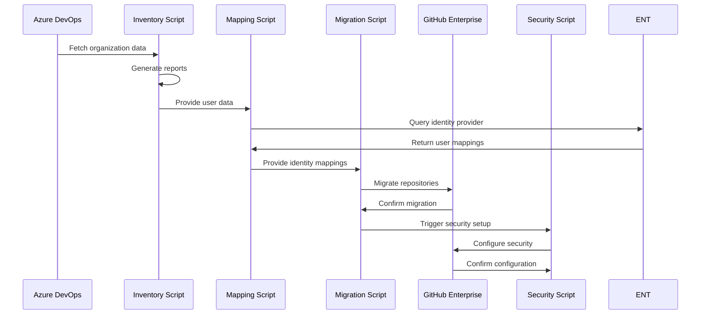

# Migration Factory Architecture

## Overview

The Azure DevOps to GitHub Enterprise Cloud Migration Factory is designed as a modular, script-driven system that automates the migration process while maintaining security, auditability, and rollback capabilities.

## System Architecture

```mermaid
flowchart TB
    subgraph Input["Input Layer"]
        ADO[Azure DevOps]
        ENT[Entra ID]
    end

    subgraph Factory["Migration Factory"]
        direction TB
        PRE[00-prereq-check.ps1]
        INV[01-inventory.ps1]
        ACT[08-analyze-activity.ps1]
        DASH[09-migration-dashboard.ps1]
        MAP[02-generate-mappings.ps1]
        MIG[03-migrate-repos.ps1]
        AUD[04-audit-pipelines.ps1]
        CON[05-convert-pipelines.ps1]
        SEC[06-configure-security.ps1]
        INT[07-configure-integrations.ps1]
    end

    subgraph Monitoring["Monitoring & Observability"]
        MON[10-monitor-migration.ps1]
        ALR[11-alert-system.ps1]
        LOG[12-log-manager.ps1]
    end

    subgraph JiraIntegration["Jira Integration"]
        JMIG[13-migrate-workitems-jira.ps1]
        JINT[14-jira-github-integration.ps1]
        JIRA[Jira Cloud/Data Center]
    end

    subgraph Output["Output Layer"]
        GH[GitHub Enterprise Cloud]
        Reports[Migration Reports]
        Workflows[GitHub Actions]
        Security[Security Workflows]
        PreCommit[Pre-commit Hooks]
        JiraWF[Jira Workflows]
    end

    subgraph Storage["Data Storage"]
        CSV[CSV Reports]
        JSON[JSON Configs]
        Logs[Execution Logs]
        Metrics[Performance Metrics]
    end

    subgraph Notifications["Alert Channels"]
        SLACK[Slack]
        TEAMS[Microsoft Teams]
        EMAIL[Email]
        CONSOLE[Console]
    end

    subgraph ExternalTools["External Security Tools"]
        SQ[SonarQube Cloud]
        CH[Checkov]
        BD[Black Duck]
        AQ[Aqua Security]
    end

    PRE --> INV
    ADO --> INV
    ADO --> ACT
    ADO --> DASH
    ADO --> MAP
    ADO --> AUD
    ADO --> MON
    ADO --> JMIG
    ENT --> MAP
    INV --> CSV
    INV --> ACT
    ACT --> CSV
    ACT --> DASH
    ACT --> MIG
    DASH --> CSV
    DASH --> MIG
    DASH --> Reports
    MAP --> JSON
    MIG --> GH
    MIG --> Logs
    MIG --> MON
    AUD --> Reports
    CON --> Workflows
    SEC --> GH
    SEC --> Reports
    INT --> Security
    INT --> PreCommit
    INT --> SQ
    INT --> CH
    INT --> BD
    INT --> AQ
    MON --> ALR
    MON --> Logs
    MON --> Metrics
    MON --> GH
    ALR --> SLACK
    ALR --> TEAMS
    ALR --> EMAIL
    ALR --> CONSOLE
    ALR --> Logs
    LOG --> Logs
    LOG --> Reports
    JMIG --> JIRA
    JMIG --> Reports
    JMIG --> Logs
    JINT --> GH
    JINT --> JIRA
    JINT --> JiraWF
    GH <--> JIRA
```

## Component Details

### 0. Prerequisites System (00-prereq-check.ps1)
- **Purpose**: Comprehensive environment validation before migration
- **Features**:
  - Tool installation verification (Git, PowerShell, GitHub CLI, extensions)
  - Token permission and scope validation
  - Connectivity testing for ADO and GitHub APIs
  - External security tool availability checking
  - Security configuration validation
  - Auto-fix capabilities for common issues
  - Detailed validation reports

### 1. Inventory System (01-inventory.ps1)
- **Purpose**: Comprehensive audit of ADO organization
- **Outputs**:
  - `inventory-repos.csv` - Repository details and metrics
  - `inventory-pipelines.csv` - Pipeline analysis
  - `inventory-users.csv` - User and permission mapping
  - `inventory-summary.json` - High-level statistics

### 1.5. Activity Analysis System (08-analyze-activity.ps1)
- **Purpose**: Identify inactive repositories before migration
- **Features**:
  - Commit activity analysis over configurable time periods
  - Pipeline run analysis (build frequency, success rates)
  - Inactivity detection with customizable thresholds
  - Migration candidate identification
  - Archival recommendations for inactive repositories
- **Outputs**:
  - `activity-analysis-full-TIMESTAMP.csv` - Complete activity report
  - `activity-analysis-active-TIMESTAMP.csv` - Active repositories only
  - `activity-analysis-inactive-TIMESTAMP.csv` - Inactive repositories
  - `activity-analysis-summary-TIMESTAMP.json` - Summary statistics
  - `migration-candidates-TIMESTAMP.csv` - Recommended migration list
- **Configuration**:
  - `-InactivityMonths` - Time window for activity detection (default: 12)
  - `-MinCommits` - Minimum commits to be considered active (default: 1)
  - `-MinPipelineRuns` - Minimum pipeline runs for active status (default: 0)
  - `-ExcludeInactive` - Generate migration-only candidate list
- **Benefits**:
  - Reduce migration scope by identifying inactive repositories
  - Prioritize active repositories for migration
  - Identify candidates for archival instead of migration
  - Improve migration time estimates with accurate repository counts

### 1.6. Migration Dashboard System (09-migration-dashboard.ps1)
- **Purpose**: Interactive migration monitoring and prioritization
- **Features**:
  - Real-time migration status tracking
  - Repository count and statistics display
  - Multiple prioritization modes (Activity, Size, Complexity, Custom)
  - Interactive priority management
  - Progress visualization
  - Migration candidate list generation
- **Outputs**:
  - `migration-priority-list-TIMESTAMP.csv` - Prioritized migration order
  - `migration-summary-TIMESTAMP.json` - Overall migration statistics
- **Prioritization Modes**:
  - **Activity**: Most active repositories first (commit frequency, pipeline runs)
  - **Size**: Smallest repositories first (quick wins, faster progress)
  - **Complexity**: Simpler repositories first (fewer pipelines, lower risk)
  - **Custom**: User-defined priority order via CSV file
  - **Interactive**: Runtime selection during dashboard session
- **Integration Points**:
  - Consumes activity analysis data from `08-analyze-activity.ps1`
  - Provides priority list for `03-migrate-repos.ps1`
  - Queries GitHub API for real-time migration status

### 2. Identity Mapping System (02-generate-mappings.ps1)
- **Purpose**: Create user attribution mappings
- **Features**:
  - Email-based exact matching
  - Fuzzy name matching for edge cases
  - Mannequin account generation for unmatched users
  - GEI-compatible mapping format

### 3. Repository Migration System (03-migrate-repos.ps1)
- **Purpose**: Bulk repository migration using GEI
- **Features**:
  - Batch processing with rate limiting
  - Parallel execution capabilities
  - Automatic retry logic
  - Progress tracking and reporting

### 4. Pipeline Analysis System (04-audit-pipelines.ps1)
- **Purpose**: Assess pipeline complexity and conversion feasibility
- **Features**:
  - YAML and Classic pipeline analysis
  - Complexity scoring algorithm
  - GitHub Actions Importer integration
  - Migration effort estimation

### 5. Pipeline Conversion System (05-convert-pipelines.ps1)
- **Purpose**: Convert ADO pipelines to GitHub Actions
- **Features**:
  - Dry-run conversion capability
  - Workflow validation
  - Batch processing
  - Migration guide generation

### 6. Security Configuration System (06-configure-security.ps1)
- **Purpose**: Apply security best practices
- **Features**:
  - Branch protection rules
  - Advanced security features
  - Team permission management
  - Dependabot configuration

### 7. Integration Configuration System (07-configure-integrations.ps1)
- **Purpose**: Configure external security tools and DevSecOps practices
- **Features**:
  - **Checkov**: Infrastructure as Code security scanning
  - **SonarQube Cloud**: Code quality and security analysis
  - **Black Duck**: Software composition analysis (SCA)
  - **Aqua Security**: Container and filesystem scanning
  - **Pre-commit hooks**: Local code quality and security checks
  - Workflow template deployment
  - Organization secret management
  - Multi-repository batch configuration

### 8. Automated Monitoring System (10-monitor-migration.ps1)
- **Purpose**: Continuous migration monitoring with health checks
- **Features**:
  - Real-time migration progress tracking
  - Health checks for Azure DevOps API, GitHub API, and network
  - Migration rate calculation and ETA estimation
  - Automatic alerting on failures, stalls, or health issues
  - Structured logging (plain text and JSON formats)
  - Performance metrics collection
- **Outputs**:
  - `logs/monitor-YYYY-MM-DD.log` - Plain text monitoring log
  - `logs/monitor-YYYY-MM-DD.json` - Structured JSON log
  - `reports/metrics/metrics-YYYY-MM-DD.json` - Performance metrics
  - `monitoring-summary-TIMESTAMP.json` - Session summary
- **Configuration**:
  - `-MonitoringInterval` - Seconds between status checks (default: 300)
  - `-ContinuousMode` - Run continuously until stopped
  - `-MaxRuntime` - Maximum runtime in hours (default: 24)
  - `-HealthCheckInterval` - Health check frequency (default: 60)
- **Integration Points**:
  - Queries Azure DevOps and GitHub APIs for status
  - Triggers Alert System for notifications
  - Feeds Log Manager for centralized logging

### 9. Alert System (11-alert-system.ps1)
- **Purpose**: Multi-channel alerting for migration events
- **Features**:
  - Multiple notification channels (Console, Slack, Teams, Email)
  - Severity-based filtering and routing
  - Quiet hours support (suppress non-critical alerts)
  - Alert cooldown to prevent spam
  - HTML-formatted email alerts
  - Rich Slack/Teams message formatting
- **Alert Types**:
  - `MigrationStarted` - Migration process initiated
  - `MigrationComplete` - All repositories migrated
  - `MigrationFailed` - Repository migration failure
  - `MigrationProgress` - Progress milestones
  - `MigrationStalled` - No progress for configured duration
  - `HealthCheckFailed` - API or network health issues
  - `RateLimitWarning` - Approaching API rate limits
- **Configuration**: `templates/alert-config.json`
  - Channel-specific settings (webhooks, SMTP, etc.)
  - Threshold configuration
  - Quiet hours and escalation rules

### 10. Log Management System (12-log-manager.ps1)
- **Purpose**: Centralized log management and analysis
- **Features**:
  - Log rotation based on file size
  - Retention-based cleanup
  - Log archival with compression
  - Log aggregation from multiple sources
  - Pattern-based log search
  - Report generation (Console, CSV, JSON, HTML)
- **Actions**:
  - `Stats` - Display log statistics
  - `Rotate` - Rotate oversized log files
  - `Cleanup` - Remove logs older than retention period
  - `Archive` - Compress and archive old logs
  - `Search` - Search logs by pattern, level, or date range
  - `Report` - Generate statistical reports
  - `Aggregate` - Combine all logs into single file
- **Configuration**:
  - `-RetentionDays` - Log retention period (default: 30)
  - `-MaxFileSizeMB` - Max file size before rotation (default: 100)
  - `-Compress` - Enable compression for archived logs

### 11. Jira Work Item Migration System (13-migrate-workitems-jira.ps1)
- **Purpose**: Migrate Azure DevOps work items to Jira Cloud or Data Center
- **Features**:
  - Full work item field mapping (title, description, state, priority, etc.)
  - Work item type conversion (Bug, Task, User Story, Epic, Feature)
  - State/status mapping between ADO and Jira workflows
  - Attachment migration with binary content preservation
  - Comment history preservation with author attribution
  - Work item link migration (parent/child, related, dependencies)
  - User mapping between ADO identities and Jira accounts
  - Batch processing with configurable size and rate limiting
  - Resume capability for interrupted migrations
  - Dry-run mode for pre-migration validation
- **Outputs**:
  - `jira-migration-report-TIMESTAMP.json` - Detailed migration report
  - `jira-migration-TIMESTAMP.csv` - Work item mapping CSV
  - `jira-migration-errors-TIMESTAMP.csv` - Failed items report
- **Configuration**:
  - `-BatchSize` - Number of work items per batch (default: 50)
  - `-MappingFile` - Custom field mapping configuration
  - `-WorkItemTypes` - Filter specific work item types
  - `-IncludeAttachments` - Migrate attachments (default: true)
  - `-IncludeComments` - Migrate comments (default: true)
  - `-IncludeLinks` - Migrate work item links (default: true)
- **Field Mappings**:
  - `System.Title` → `summary`
  - `System.Description` → `description` (Atlassian Document Format)
  - `System.State` → `status` (with transition mapping)
  - `System.AssignedTo` → `assignee`
  - `Microsoft.VSTS.Common.Priority` → `priority`
  - `System.Tags` → `labels`
  - `Microsoft.VSTS.Scheduling.StoryPoints` → custom field
- **Work Item Type Mappings**:
  - Bug → Bug
  - Task → Task
  - User Story → Story
  - Feature → Epic
  - Epic → Epic

### 12. Jira-GitHub Integration System (14-jira-github-integration.ps1)
- **Purpose**: Configure bidirectional integration between Jira and GitHub Actions
- **Features**:
  - Automatic Jira issue transitions based on GitHub PR lifecycle
  - Commit and PR linking to Jira issues via issue key detection
  - Branch name and PR title validation for Jira issue keys
  - Release notes generation from Jira fixVersion
  - GitHub issue to Jira synchronization (with label trigger)
  - Bidirectional status synchronization via labels
  - Organization-level secret configuration
  - Multi-repository workflow deployment
- **Deployed Workflows**:
  - `jira-issue-transition.yml` - PR-based Jira transitions
  - `jira-create-issue.yml` - GitHub to Jira issue creation
  - `jira-sync-status.yml` - Status synchronization
  - `jira-release-notes.yml` - Release notes generation
- **GitHub Events → Jira Actions**:
  - PR Opened → Transition to "In Progress" / "In Review"
  - PR Merged → Transition to "Done" / "Resolved"
  - Push to main → Add commit comment to linked issue
  - Issue labeled "sync-to-jira" → Create Jira issue
  - Release published → Generate release notes from fixVersion
- **Configuration**:
  - `-DeployWorkflows` - Deploy GitHub Actions workflows
  - `-ConfigureSecrets` - Set up organization secrets
  - `-Repositories` - Target specific repositories
  - `-TransitionMappings` - Custom event-to-transition mapping
- **Required Secrets** (configured automatically):
  - `JIRA_BASE_URL` - Jira instance URL
  - `JIRA_USER_EMAIL` - API authentication email
  - `JIRA_API_TOKEN` - Jira API token
  - `JIRA_PROJECT_KEY` - Default project key
- **Integration Points**:
  - Consumes work item data from `13-migrate-workitems-jira.ps1`
  - Deploys workflows to GitHub repositories
  - Configures organization/repository secrets
  - Enables bidirectional GitHub ↔ Jira communication

## Data Flow

## Security Architecture

### Authentication Flow
1. **Azure DevOps**: PAT-based authentication with minimal required permissions
2. **GitHub Enterprise**: Token-based authentication with appropriate scopes
3. **Entra ID**: SCIM provisioning for user lifecycle management

### Permission Management
For detailed permission requirements, see the [Permissions Matrix](permissions-matrix.md) which includes:
- Phase-by-phase permission requirements
- Token creation and security best practices
- Survey vs. migration permission differences
- External security tool authentication requirements
- Compliance and audit considerations

### Data Protection
- All tokens stored in environment variables (never in code)
- Network traffic encrypted via HTTPS/TLS
- Sensitive data redacted from logs
- Audit trail maintained for all operations

### Access Control
- Scripts require explicit permission grants
- WhatIf mode for testing without changes
- Rollback capabilities for critical operations
- Comprehensive logging and monitoring

## Scalability Design

### Batch Processing
- Configurable batch sizes to manage rate limits
- Parallel execution where appropriate
- Progress tracking and resumption capabilities
- Error isolation per batch

### Performance Optimization
- Efficient API usage patterns
- Caching of frequently accessed data
- Incremental processing capabilities
- Resource usage monitoring

## Error Handling

### Retry Logic
- Exponential backoff for transient failures
- Configurable retry counts per operation
- Graceful degradation for non-critical failures
- Circuit breaker pattern for external services

### Recovery Mechanisms
- Checkpoint-based progress tracking
- Rollback procedures for failed migrations
- Manual intervention points for complex issues
- Comprehensive error reporting

## Monitoring and Observability

### Logging Strategy
- Structured logging with correlation IDs
- Multiple log levels (INFO, WARNING, ERROR)
- Performance metrics collection
- Audit trail maintenance

### Reporting
- Real-time progress indicators
- Comprehensive migration reports
- Success/failure statistics
- Performance metrics and timing

## Integration Points

### External Services
- **Azure DevOps REST API**: Organization, project, and work item data
- **GitHub REST API**: Repository and security management
- **GitHub CLI Extensions**: GEI and Actions Importer
- **Entra ID**: User identity and group management
- **Jira REST API**: Issue management and workflow transitions
- **Atlassian Document Format (ADF)**: Rich text content for Jira descriptions

### Jira Integration
- **Jira Cloud**: Full API support via Atlassian Cloud REST API v3
- **Jira Data Center**: On-premises Jira with REST API v2/v3
- **Authentication**: API token-based authentication (email + token)
- **Supported Operations**:
  - Create, update, and transition issues
  - Upload attachments and add comments
  - Manage issue links and relationships
  - Query issues via JQL (Jira Query Language)
  - Configure webhooks for bidirectional sync

### Internal Dependencies
- PowerShell Core runtime
- GitHub CLI with required extensions
- Azure CLI (optional, for enhanced features)
- Network connectivity to cloud services
- Jira API access (for work item migration)

## Deployment Considerations

### Infrastructure Requirements
- PowerShell Core 7.x or later
- GitHub CLI latest version
- Sufficient disk space for reports and logs
- Network access to Azure DevOps and GitHub

### Operational Requirements
- Service principal or PAT with appropriate permissions
- Organization owner access for GitHub
- Entra ID admin access for identity configuration
- Backup and recovery procedures

## Future Enhancements

### Planned Features
- Web-based dashboard for migration monitoring
- Automated rollback capabilities
- Integration with CI/CD pipelines
- Advanced reporting and analytics

### Extensibility
- Plugin architecture for custom transformations
- Configuration-driven migration rules
- API for external tool integration
- Custom reporting templates